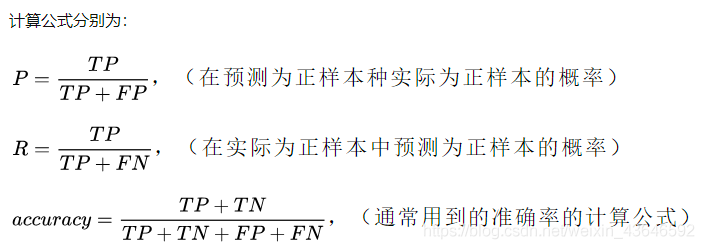

# Yolo v5 小目标识别

## 训练

```shell
python train.py --weights yolov5s.pt --cfg models/yolov5s_visdrone.yaml --data data/VisDrone.yaml --hyp data/hyps/hyp_yrj_visdrone.yaml --epochs 60 --batch-size 32 --img-size 640 --device 0
```


## 网络配置文件

```
# [from, number, module, args]
  [-1,   1,      Conv,   [64, 6, 2, 2]]
args[0] 输出的通道数out_channels
args[1] kernel_size
args[2] stride
args[3] padding

起始输入通道数 ch = 3

# Conv原型
Conv(ch_in, ch_out, kernel, stride, padding, groups, act=True)
- ch_in
- ch_out    =>  args[0]
- kernel    =>  args[1]
- stride    =>  args[2]
- padding   =>  args[3]

```

## 评价指标
- True positives: 简称为TP，即正样本被正确识别为正样本
- True negatives: 简称为TN，即负样本被正确识别为负样本
- False Positives: 简称为FP，即负样本被错误识别为正样本
- False negatives: 简称为FN，即正样本被错误识别为负样本

IOU：IoU是预测框与ground truth的交集和并集的比值。
     先为计算mAP值做一个铺垫，即IOU阈值是如何影响Precision和Recall值的？
     比如在PASCAL VOC竞赛中采用的IoU阈值为0.5，而COCO竞赛中在计算mAP较复杂，
     其计算了一系列IoU阈值(0.05至0.95)下的mAP当成最后的mAP值。

P，Precision：精确率，P = 正确数/ 正确数+错误数。即，预测的东西正确了多少百分比。

R，Recall：召回率，R = 预测正确数 / 真实A类总数。即，预测的东西找到了多少百分比。



Recall度量的是「查全率」，所有的正样本是不是都被检测出来了。比如在肿瘤预测场景中，要求模型有更高的recall，不能放过每一个肿瘤。

Precision度量的是「查准率」，在所有检测出的正样本中是不是实际都为正样本。比如在垃圾邮件判断等场景中，要求有更高的precision，确保放到回收站的都是垃圾邮件。

AP：Average Precision，

mAP：mean Average Precision，每个类的AP值的平均数。

mAP@.5:.95（mAP@[.5:.95]）
表示在不同IoU阈值（从0.5到0.95，步长0.05）上的平均mAP。


## 导出模型

```shell
pip install onnx
pip install coremltools

python export.py --weight yolov5m.pt --img 640 --batch 1
```